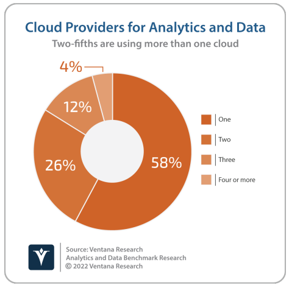

<!--StartFragment-->

Adoption of cloud and edge computing infrastructure has brought many benefits to organizations of all
sizes. It has improved business agility by reducing the need for upfront purchasing, configuration and
deployment of infrastructure, and reduced the complexity and cost of data movement by taking data
processing closer to where the data is generated. However, this has also increased risks associated
with fragmentated data silos, exacerbating data integration, management, and governance challenges
and adding a greater degree of unpredictability related to evaluating data infrastructure cost and
performance.

Data storage and processing is now distributed across a complex array of private data centers, multiple public cloud computing infrastructure providers and edge devices. Almost one-half (49%) of respondents to Ventana Research’s Analytics and Data Benchmark Research are using cloud computing for analytics and data, and 42% are currently using more than one cloud provider. These cloud computing resources need to be utilized in conjunction with ongoing use of on-premises infrastructure, including centralized data centers as edge computing resources like Internet of Things (IoT) devices or servers and local data centers located close to the source of the data. 

There are a variety of reasons for analytics and data workloads to remain on-premises. More than onehalf (57%) of respondents to Ventana Research’s Analytics and Data Benchmark Research are not planning to use the cloud for analytics and data workloads, and these organizations cited security as a primary reason, followed by a lack of skills or resources (39%) and regulatory reasons (26%). Other considerations include application performance and the need to make the most efficient use of existing data center investments. Meanwhile, edge computing infrastructure is essential to supporting low-latency data processing requirements and minimizing the unnecessary movement of IoT data. 

As such, there is a growing requirement for organizations to adopt a computing architecture that spans hybrid IT, multi-cloud and edge environments. The cloud providers have responded to this need with distributed cloud architecture, which is characterized by the deployment of cloud software and infrastructure in on-premises locations, including centralized data centers and edge environments. These providers also utilize containers and container orchestration systems such as Kubernetes to automate software deployment, scaling, and management and support workload portability. 

While container orchestration is fundamental for workload orchestration and portability, it does little to address data management in a distributed cloud environment. A distributed data tier is also required to enable the orchestration, management and processing of data in multiple locations. The various cloud providers all offer data management and processing services of their own, which are in the process of being rolled out across distributed cloud infrastructure. However, utilizing distributed cloud infrastructure and data services from the same provider raises the risk of organizations becoming overly dependent on a single supplier.

 For organizations looking to lower risk, a cloud-agnostic data tier spanning multiple cloud providers can add a layer of confidence in relation to business continuity planning and avoidance of vendor lock-in. Almost all data platform vendors offer produc ts that can be deployed and consumed across onpremises, multi-cloud and edge locations. But running the same data platform in multiple environments is not the same as a distributed data tier. Data processing that spans distributed cloud requires the abstraction of the data tier from the underlying infrastructure, providing a consistent user interface and single unified control plane for data processing across the distributed cloud. 

As with dedicated on-premises and cloud environments, the engine of this distributed data tier will be the data platform itself—whether a data warehouse or data lake—but distributed data cloud architecture also raises the need to distribute data management, data governance and business intelligence functionality alike. A cloud-agnostic distributed data tier will also need to provide functionality to address workload management (including cluster resource utilization), as well as data security and privacy, and provide clarity regarding capacity and consumption-based pricing across the distributed cloud. This clarity enables data experts to make educated decisions about workload placement in addition to query planning and execution based on a combination of cost, regulatory and performance requirement parameters. 

The days of debating whether the data architecture of the future will be on-premises or in the cloud are long-gone. The data architecture of the future will need to span multiple cloud, on-premises and edge locations. Distributed cloud promises to deliver the underlying containerized infrastructure to support workload deployment and portability across such an environment. Organizations should nonetheless consider deploying an accompanying cloud-agnostic distributed data tier to provide a unified control plane for data processing and data management.

<!--EndFragment-->