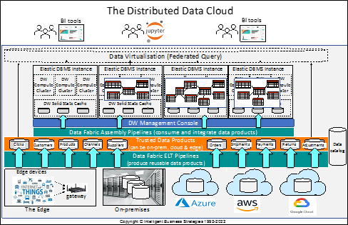

Many companies today are running applications and storing data in a hybrid computing environment that spans on-premises, one or more clouds and the edge. On-premises includes core transaction processing systems like ERP, HR and Procurement systems and analytical systems like traditional data warehouses and Hadoop. Also, there are many file shares, PCs and laptops on-premises storing office documents and files of various types. However, the digital transformation initiatives have changed all this with the adoption of SaaS transaction processing applications, SaaS collaborative applications and the deployment of different types of analytical systems on one or more public clouds.  This includes cloud data warehouses, graph databases and machine learning initiatives on data stored in cloud storage data lakes like AWS S3, Azure Data Lake Storage and Google Cloud Platform storage.  At the edge it could be IoT devices that have been deployed to gain insight and improve efficiency of business operations. Alternatively, it could be consumer products with built-in sensors that emit data available for analysis to try to understand product usage behaviour and to enhance customer experience. 

If you take a step back from all this and look at it, you can see two clear observations that have and are happening. The first is the fact that data is increasingly spreading out across this hybrid on-premises, multi-cloud and edge computing environment to such an extent that businesses now have a distributed data estate. In a global business that estate can not only span on-premises, multiple clouds and the edge but also span multiple regions of a cloud service provider and multiple on-premises data centres to support users in multiple geographies. All of this makes data harder to find, harder to manage and harder to govern in a world where the number of data sources continues to grow, and the number of compliance regulations and legislation is also increasing. 

Yet, despite this setup, if you look at the world of analytics, the second observation you can make is that we are still, by and large not embracing hybrid distributed computing environment to the maximise the value of analytics. Yes, you can source data from different places across a distributed data estate, but we still implement centralised analytical systems, whether they be data warehouses, data lakes or lakehouses that run on-premises or on a specific cloud. The principal is still that you should bring all data to a central data store where it can be prepared and analysed.   With this approach, you can still have multiple data warehouses (as many companies do) be they on-premises, on a cloud or both, but in general each analytical system is still run as an independent silo and often implemented on different DBMSs. Companies select the DBMS of choice and where to deploy it and then everything happens in that one place.  The exception to this is IoT where trained machine learning models are deployed at the edge to analyse data where it originates and act locally on real-time data.  But I would like to ask why can’t a Data Warehouse embrace and exploit the distributed hybrid computing environment that companies are now operating to support the multiple analytical use cases across the business?

There have already been several writings about the centralised development approach taken in analytical systems. In general, this is dependent on centralised data engineers building all the pipelines to pull data from many different data sources and clean and integrate it while the business waits to get access to the data. The emergence of Data Mesh  would be a good example of such writings. The author of that approach highlights the bottleneck caused by centralised IT and data science data engineers who do not have intimate knowledge of source data. She then proposes that business domain-based data teams should be building pipelines instead to produce data products that can be shared across the business in support of different analytical workloads. What Data Mesh does, is seek to address organisational and data engineering productivity issues, to speed up the production of reusable data products and clear the aforementioned bottleneck.  It is a decentralised approach to data product development. However, it doesn’t focus on how organisations can make use of a hybrid on-premises, multi-cloud and edge computing environment as if it were a single canvas to run data lakes, data warehouses, data marts, data science  and in-database analytics in the best place to meet business needs. Companies need to do this while remaining compliant on data sovereignty. In other words, not to be ‘nailed’ to just running on-premises or on a specific cloud operating environment but to build analytical systems in an agile way that:  

* Uses and reuses data products 
* Leverages component-based development including schema components and component-based ETL pipelines
* Has the flexibility to deploy storage and compute resources anywhere in a ‘distributed data cloud’ and control it all from a single console 

Consider the following diagram which enables multiple teams of data product producers to creating different dimensional and fact-based data products using a data catalog to source the data and data fabric software to build the pipelines. These data products can be persisted anywhere in the distributed data landscape including on premises and on one or more clouds with data lakes (e.g. cloud storage) being an obvious place.  It then introduces component-based data warehouse and data mart development on top of this whereby the data products produced represent data warehouse schema components that can be consumed and assembled to create data warehouses, data marts and in-database analytical workloads that can run on-premises, on one or more clouds, at the edge or across all of these environments. The idea is that elastic analytical relational DBMS instances can run anywhere across the hybrid computing environment and be managed from a single place as if it was one environment. This is possible today thanks to the power of Kubernetes which allows software to be deployed anywhere. 

There is separation of storage from compute in each RDBMS instance with multiple compute clusters being used to isolate workloads.  Data consistency is provided by building dimension and fact data products once and reusing them everywhere they are needed. This prevents reinvention of data engineering pipelines, eradicates silos, and enables data warehouses, data marts and other analytical workloads to run on-premises, or on any cloud. It is even possible to support multi-dimensional analysis of streaming data at the edge.  It also potentially means you could start out on-premises and move to the cloud with no difference in operation.

Furthermore, the Kimball approach to incrementally building data warehouses can be easily applied in the diagram shown.  Scalable data warehouses and data marts can be built and flexibly deployed anywhere in the hybrid computing environment to meet business needs. In addition, business intelligence, machine learning model development and deployment can happen across all instances and federated query can be used to query data across instances if required. As long as it remains invisible to the user, there is good workload management and good massively parallel query performance, then it should not matter. It is like we are treating on-premises, multiple clouds and edge computing like it is a single distributed computing resource that we can use as a distributed data cloud.